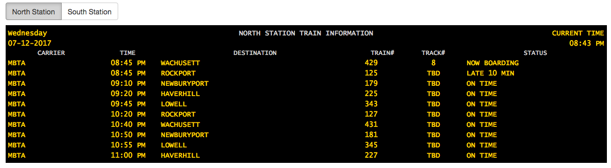

# DEPARTURE BOARD FEED

Personal exercise to create a Train Departure Board Feed based on the MBTA data feed.

## How to run
This project uses on Python 3.6, Django and Django Rest Framework.

I have not had the possibility to move it to a docker environment yet, so to run this code you need to have Python 3.6 (but it should work on 3.5 as well). I also suggest to create a virtual environment.

When your python environment is ready you will need to install the dependencies
```
pip install -U -r requirements.txt
```
And simply start the test web server
```
python manage.py runserver 0.0.0.0:8888
```
The board should be available at http://localhost:8888/ and it should look like these screenshots:




You can switch from the North Station to the South Station Departure boards using the buttons on top of the page.

## Missing features and TODOs

* Unit tests: I did not write any, but this should be priority #1 in a future iteration of the project
* Docker environment so the code can run with (almost) production like settings
* Better UI, Javascript and CSS: I used some basic jquery, but this project is the perfect candidate for some REACT
* Frontend should handle errors from rest API better, maybe show a warning
* Use async tasks in the backend to refresh the data and push the changes to the frontend instead of letting the frontend pulling the data every 30 seconds
